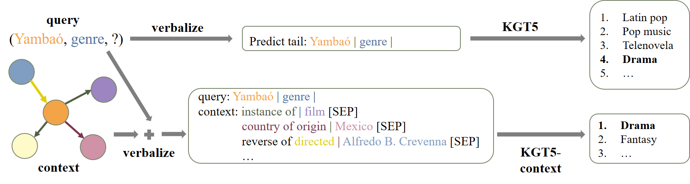

[](https://paperswithcode.com/sota/link-prediction-on-wikidata5m?p=friendly-neighbors-contextualized-sequence-to)

# KGT5-context

This is the repository for the RepL4NLP@ACL 2023 paper ["Friendly Neighbors: Contextualized Sequence-to-Sequence Link Prediction"](https://arxiv.org/abs/2305.13059).

It is a simple extension of the verbalization of KGT5 with the 1-hop neighborhood of the query entity as context.


## Table of contents
1. [Method](#method)
2. [Getting Started](#getting-started)
3. [Reproduction](#reproduction)
4. [Wandb](#wandb)
5. [QA with KGT5](#kgt5-for-qa)

## Method



### KGT5

[KGT5](https://github.com/apoorvumang/kgt5) trained a T5 Transformer for link prediction over knowledge graphs (given a head/tail entity and relation, predict the tail/head entity). Input to the model is a verbalized query using mentions of the query-entity and relation, and expected output is the mention of the target entity.

Example input/output:

input: `predict tail: Yambáo | genre`

expected output: `Drama`

### KGT5-context

KGT5-context is a simple extension of KGT5.
We additionally provide the model with the 1-hop neighborhood around the input entity. 

Example input/output:

input: 
```
query: Yambáo | genre
context:
instance of | film
country of origin | Mexico
reverse of directed | Alfredo B. Crevenna
...
```

expected output: `Drama`

## Getting Started

```
git clone git@github.com:uma-pi1/kgt5-context.git
cd kgt5-context
conda create -n kgt5 python==3.10
conda activate kgt5
pip install -r requirements.txt
```

### Download Data

Note: the dataset is called wikidata5m_v3 as this is the final version of the dataset published with the third arxiv version of the Kepler paper.
The second arxiv version had a slightly different split.

```
mkdir data
cd data
curl -O https://web.informatik.uni-mannheim.de/pi1/kge-datasets/wikidata5m_v3.tar.gz
tar -zxvf wikidata5m_v3.tar.gz
```


## Reproduction
### Training

To train the KGT5-context on Wikidata5M, run the following command.
Note, this library will automatically use all available GPUs.
You can control the GPUs used with the environment variable `CUDA_VISIBLE_DEVICES=0,1,2,3`

```
python main.py dataset.name=wikidata5m_v3 train.max_epochs=6
```

If you want to utilize descriptions (provided with Wikidata5M), run

```
python main.py dataset.name=wikidata5m_v3 train.max_epochs=6 descriptions.use=True
```

If you want to train the original KGT5 without context use

```
python main.py dataset.name=wikidata5m_v3 dataset.v1=True
```

### Evaluation
To evaluate a trained model run

Note: the trained model is stored in the automatically generated output folder. The config file is placed in the `.hydra` folder in the same output folder.

```
python eval.py --config <path to config> --model <path to trained model>
```

### Checkpoints
For reproduction of presented results we provide some checkpoints.

#### KGT5
- original KGT5 using mentions only

```
# Make sure you have git-lfs installed (https://git-lfs.com)
git lfs install
git clone https://huggingface.co/apoorvumang/t5-small-wd5mv3-adafactor_82ep

python eval_legacy_huggingface.py -m t5-small-wd5mv3-adafactor_82ep --v1 --is_legacy
```

#### KGT5 with descriptions

```
# Make sure you have git-lfs installed (https://git-lfs.com)
git lfs install
git clone https://huggingface.co/AdrianKs/kgt5-descriptions-wikidata5m

python eval.py -m kgt5-descriptions-wikidata5m/pytorch_model.bin -c kgt5-descriptions-wikidata5m/config.yaml
```

#### KGT5-context
- mentions only

```
# Make sure you have git-lfs installed (https://git-lfs.com)
git lfs install
git clone https://huggingface.co/AdrianKs/kgt5-context-wikidata5m

python eval.py -m kgt5-context-wikidata5m/pytorch_model.bin -c kgt5-context-wikidata5m/config.yaml
```

#### KGT5-context with descriptions

```
# Make sure you have git-lfs installed (https://git-lfs.com)
git lfs install
git clone https://huggingface.co/AdrianKs/kgt5-context-descriptions-wikidata5m

python eval.py -m kgt5-context-descriptions-wikidata5m/pytorch_model.bin -c kgt5-context-descriptions-wikidata5m/config.yaml
```


## Wandb
This library supports logging via wandb.
If you want to use it, use the option `use_wandb=True`

Note, output directory and wandb project name are defined in the file `conf/config.yaml`. 


## KGT5 for QA
Unfortunately, QA is not supported by this repository. 
For QA, please visit the original [KGT5 repository](https://github.com/apoorvumang/kgt5).

## How to cite
If you use the provided code or refer to the results presented in the paper, please cite.


```
@inproceedings{kochsiek2023friendly,
    title={Friendly Neighbors: Contextualized Sequence-to-Sequence Link Prediction},
    author={Kochsiek, Adrian and Saxena, Apoorv and Nair, Inderjeet and Gemulla, Rainer},
    booktitle={Proceedings of the 8th Workshop on Representation Learning for NLP},
    year={2023}
}

```


